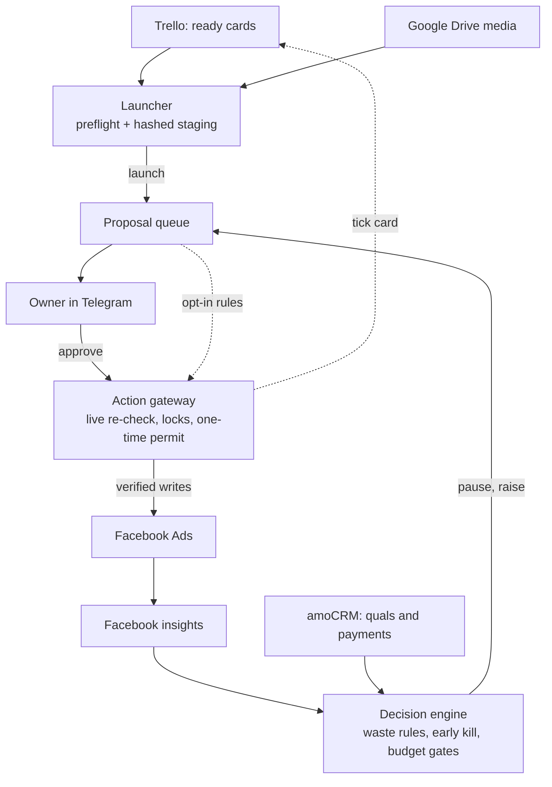

# Yuko

**Autonomous media buyer that pauses ads by payments, not CPL.**

[](https://www.python.org/)
[](https://fastapi.tiangolo.com/)
[](LICENSE)
[](tests/)

**English** · [Русская версия](README.ru.md)

Yuko is an autonomous media buyer for Facebook and Instagram. It launches creatives straight from a Trello board, follows every ad into amoCRM to see which leads actually qualified and paid, and proposes what to pause, what to scale and what to launch next. You approve with one tap in Telegram, or switch on rules that act on their own.

- 🎯 **Judges ads by money, not CPL.** Qualified leads, payments and ROMI per ad, straight from the CRM.
- 🚀 **Launches from Trello.** Many cities and ad accounts, crash-safe; missed cities are topped up later.
- 🛑 **Kills waste early.** Waste rules and early-kill rules with maturity windows. Missing data never triggers a pause.
- 💸 **Scales only what sells.** Budget raises only for ad sets with payments, within the media plan and hard caps.
- 🔒 **Safe by design.** Every change is re-checked live, runs on a one-time permit and is verified afterwards.
- 📲 **Owner in the loop.** Signed Telegram buttons, a daily digest and a command console.

Self-approval is off by default. Every switch that changes ads is listed under [Configuration](#configuration).

> **Reference implementation.** Yuko was built for one real business and ran against its live ad accounts, with identifiers replaced. Read [Status & limitations](#status--limitations) before you plan to deploy it.

---

## Why Yuko

A cheap lead is not a customer. A lead form can bring in a steady stream of low-CPL leads that never qualify and never pay. If you judge by CPL alone, that ad looks like a winner while it burns money. A media buyer usually learns this only after tracing CRM deals back to ad IDs, and by then the budget is spent.

Yuko closes the loop between the ad platform and CRM payments:

- It matches amoCRM leads to ads by the exact `fb_ad_id`. Older leads that lack one fall back to matching by ad name. It then counts qualified leads, payments, revenue and ROMI **per ad**. Optionally it also counts payments from your payment accounting system, so a sale that was recorded there but not in the CRM still counts. This is opt-in through the `payments_source` setting; by default those payments are only logged.
- It lets data mature before judging. The rules that may self-approve count qualification only on mature leads (72 h by default). A "no payments" verdict needs an ad at least 14 days old, which is one payment cycle.
- It pauses only when explicit evidence thresholds are met. Missing CRM data never causes a pause, and an unknown payment count is never read as zero.

**Terms used below.** *MQL*: qualified-lead event. *Payment accounting system*: wherever your business records actual payments (accounting or billing software). *CityA…CityF*, *PRODA / PRODB* (Product A / B) and *L1 / L2* (two ad languages) are neutral placeholders: replace them with your own cities, product lines and languages.

## What it does

### Launch creatives from Trello
- **Ready-queue intake.** Picks unlaunched cards from the Trello "Ready" column, top to bottom. Card labels set the campaign type and target cities. If a card has no city label, Yuko reads the city from the end of the card name.
- **Drive media → ad format.** Downloads the card's Google Drive file or folder and picks the format: one ad per video, single-image ads, a carousel (up to 10 cards), or feed + story placement pairs.
- **Hashed staging.** Writes a manifest to disk that freezes the card snapshot, the SHA-256 of every media byte, the ad text, the target ad sets and the deterministic ad names. What gets approved is exactly what gets launched.
- **Routing and discovery.** Scans the ad accounts for the newest live ad set per city and ad set type (ad language, product line, website traffic). A map in `settings.json` routes each pair to an ad account. An unrouted pair is refused; there is no default account.
- **Preflight checker.** Refuses to launch into an ad set that isn't ACTIVE, already holds this creative, or has no room under Facebook's 50-ads-per-ad-set limit plus one reserved slot.
- **Ads only.** A launch adds ads to existing ad sets and leaves their budgets unchanged.
- **Crash-safe attempts.** Each launch is tracked per card and per city. After a crash, the outcome is rebuilt from real Facebook data, and missed cities are topped up later without relaunching the rest.
- **Checkmark after it's live.** The launch watchdog ticks the Trello card once it confirms the ads are ACTIVE. A separate hourly reconciler ticks cards whose ads were created outside the pipeline. It never removes a tick.

### Judge ads by CRM outcomes
- **CRM outcome matching.** Attaches qualified leads, payments, revenue, ROMI and cost per qualified lead to every ad. Payments are de-duplicated per contact, and payments from the accounting system are netted per deal. When that source is switched on, the payment count is the larger of the CRM count and the accounting count.
- **Waste rules.** A *confirmed waster* meets all of these, and the result is a pause proposal for the owner:
  - more than $300 spent and at least 15 leads;
  - qualification below 25%, or unknown;
  - exactly 0 payments;
  - a finished CRM reconciliation;
  - an ad at least 14 days old.

  Two narrower rules look only at mature data, and they are the only ones the narrow self-approval mode acts on:
  - *mature zero*: 15+ leads older than 72 h, none qualified, $150+ spent, ad at least 5 days old;
  - *dead silence*: $50+ spent over the last 7 days with zero leads, ad at least 10 days old.

  Both were checked against historical data before being allowed to act on their own. Two more detectors cover other patterns: **no-revenue** (qualified leads but no sales after $500+) and **family** (one creative wasting money in several cities). A calendar rule (0 lifetime leads after 3 full days) also proposes pauses unless `thresholds.zero_leads_rule_enabled=false`.
- **Early kill.** Four rules, each with its own `off / shadow / active` mode (`shadow` by default):
  - **A** (spend, no leads) and **B** (mature leads, none qualified) run hourly on ads younger than 14 days. Their thresholds scale with the account's own CPL.
  - **C** (qualification too expensive or degraded) runs once a day over a 14-day window.
  - **S** pauses "starving" ads (under $15 spent in 14 days, no leads) in crowded ad sets to free slots. The code states that these ads are not wasters.

  In `active` mode a rule self-approves its own pauses. Rule A trades some precision for speed, which is why it ships in `shadow`.
- **Portfolio ranking.** Compares each ad with its peers in the same city, ad set type and objective. The only ad in a group is never disabled, and neither is the best one.
- **Hold instead of pause.** Gives a low-ranked ad that shows payment potential a few days' grace, then pauses it if no new payments arrive. Off by default: `autopilot.hold_enabled`.
- **Weekly cohort trend.** Tracks the qualification rate week over week, using measured noise floors and Wilson intervals. A declining trend can veto a budget raise, add weight to a pause, or turn a weak (tier-B) ad into a pause. It never triggers a raise. Ships in `shadow`.
- **CRM → Meta.** Sends qualified lead-form leads back to Meta as `MQL` events through the Conversions API, and also to GA4.

### Budget with brakes
- **Raises only, only for sellers.** Proposes budget raises for ACTIVE ad sets whose ads have confirmed payments. It never lowers a budget. One significant confirmed waster in an ad set blocks raises for that whole ad set.
- **Plan gates.** Before a raise, Yuko checks:
  - headroom in the weekly media-plan budget;
  - ad-spend-to-revenue ratio against the target;
  - a revenue forecast from the payment accounting system, trusted only when warm, accurate and fresh;
  - a seasonal pacing curve;
  - a forecast self-check.

  If no plan source can be read, raises are blocked.
- **Caps.** Each raise is capped three ways: by the start-of-day budget, by a per-ad-set ceiling and by an account-wide total. Pending raises are reserved on disk *before* the Facebook call, so a crash cannot cause a double raise.
- **Read-only watchdogs.** Alerts cover ad sets with zero spend or overspend, abnormal daily spend, per-city CPL spikes, bursts of Facebook API errors, DISAPPROVED ads, expired offers still running, missing Facebook leads in the CRM, and silent crons.

### Creative intelligence
- **Attention and outcomes.** Tracks hook rate, hold rate, a 2×2 creative matrix (Winner / Clickbait / Hidden Gem / Dead) and fatigue flags. All of it is stored with CRM outcomes in a SQLite creative knowledge base.
- **Scoring and diagnosis.** A 0–100 rubric built on Gemini vision and text scoring. A step-by-step diagnosis (hook → hold → CTR → conversion → fatigue) returns one concrete fix and the most similar winners.
- **Patterns.** A miner reports which slices beat the baseline. An early-signal engine learns which day 1–7 metrics predict lifetime CRM success, and outcome data never leaks into its features.
- **Fact-checked briefs.** Off by default. Topics fill coverage gaps first, then vary creatives that actually sold. Claude writes the scenario. A deterministic validator blocks invented statistics, fake deadlines and the wrong format, then a second LLM review runs. The owner's approval is meant to turn a brief into a Trello card, but that button is not wired up yet (see [Known gaps](#status--limitations)).
- **Copywriter.** Produces structured ad variants from a forced tool call, validated against a Pydantic schema. Few-shot examples come from the knowledge base's winners and losers.
- **Hypothesis journal.** Records a measurable expectation for a launch and, after 7–14 days, judges it against real sales. The verdict nudges future topics. Launches that run through the approval gateway do not record a hypothesis yet (see Known gaps).

### Dashboard and owner control
- **Dashboard.** A 12-tab single-page UI served by FastAPI: Overview, Launch, Analytics, Funnel, Sources, Comparison, Learning, Decisions, History, Generator, Settings, Notifications. The UI itself is in Russian; these names are translations. Every API path needs an `X-API-Key` except the amoCRM webhook, which checks its own shared secret. The dashboard shell, `/health` and static files are public. Provider-backed endpoints are rate-limited.
- **Telegram.** Approval cards carry signed Approve / Reject / Postpone buttons. Proposals are also batched into a daily digest with "approve all" / "reject all". Console commands include `/status`, `/queue`, `/pause`, `/unpause`, `/scale`, `/launch` and `/digest`. Commands that would change something only create proposals.

## How it works



1. **Propose.** The launcher, the autopilots, early kill, the budget scaler and the Telegram console never write to Facebook. Each one files an immutable proposal with the intended payload, its SHA-256 and the supporting evidence. A proposal lives for 48 h, or 4 h if it came from a Telegram console command.
2. **Decide.** The owner presses a signed Telegram button. Where the owner has switched it on, a named rule approves instead. Rule approvals are recorded as `SYSTEM` decisions, so the audit trail always tells them apart from human clicks.
3. **Re-check.** Every 30 minutes, an execution queue picks up approved jobs. For each one it rebuilds the manifest from live state and re-reads Facebook, Trello, the media bytes, amoCRM and the payment accounting system. If anything has drifted since approval, the job stops.
4. **Write.** A single-use permit is issued after the live re-check. It is consumed in the same transaction that starts the attempt, before any network call.
   - Pause, unpause and budget changes make exactly one mutating call. That call is re-sent only if Facebook answers with a rate-limit error.
   - A launch attempt uploads media, then creates the ads. It writes a durable claim before each ad-create call.
   - A clear rejection is recorded as a rejection. An ambiguous outcome is recorded as `UNKNOWN` and settled by reads, never by a blind retry.
5. **Verify.** A live post-read confirms the change. A separate read-only verifier re-checks everything from the last 24 h and settles unclear outcomes from provider facts.

## A day with Yuko

APScheduler runs about 50 jobs inside the FastAPI app, on a fixed local timezone (`Etc/GMT-5`, i.e. UTC+5, by default). Most jobs tick every 10–30 minutes and check the hour themselves. Each keeps per-slot state, so a repeated tick cannot run the same job twice. The table below is a selection.

| Time | What runs |
| --- | --- |
| 00 · 06 · 12 · 18 | Match amoCRM outcomes onto every ad |
| 01:xx–05:xx | Recent-ads sync (01), creative knowledge base backfill (02–05), daily-metrics backfill (03–05) |
| 03:xx | Expired-offer guard: alerts on ads still spending after their offer date |
| 04:xx | Back up `decisions.db` (7 copies kept) |
| 05:xx | Read-only ad set capacity scan |
| 06:xx | Daily metrics snapshot · hypothesis verdicts · slot cleaner every 3rd day (dry run by default) |
| 07:xx | Sync payments from the payment accounting system |
| 08:xx | Google Ads spend capture · morning digest · first live-autopilot and guardian slot (then every 2 h until 22:00) |
| 09:xx | Owner proposal digest · autonomous-pause summary (only if there were pauses) · ad set spend guard · coverage summary |
| 10:xx | Daily auto-launch run · classic autopilot · early-kill rules C and S · online sales report |
| 11:xx | Weekly cohorts (input for the trend) |
| 12:xx | Full spend and status refresh |
| 13:xx | Budget scaler |
| 14:xx | Check today's launches for disapproved ads, ads stuck in review and ads with 0 impressions |
| 15:xx · 20:xx | Classic autopilot; daily launch funnel summary after 20:00 |
| 21:xx | Evening report |

**All day:**
- Every minute: owner button presses.
- Hourly: early-kill rules A and B, Trello checkmark reconciler.
- Every 30 min: approved-job execution, CAPI `MQL` events, launch watchdog, coverage guard.
- Every 15 min: owner message delivery, post-execution verifier, Facebook-lead watchdog, autonomy invariant check.

**Weekly:** Sunday: pattern miner and early-signal engine (early morning), scorecard (19:xx), learning report (20:xx). Monday and Thursday 08:xx: brief generator (off by default).

## Safety first

Yuko is built to run against a live, paying ad account, so each write path is designed to fail safely.

- **Proposals, not writes.** Code that makes decisions files proposals instead of changing ads. The one exception is the slot cleaner's archive step, which is off by default. The public `execute_action` entry points always raise `OwnerConsentRequired`.
- **One attested transport.** Only `integrations/facebook_ads_mutation_transport.py` writes to the Marketing API for approved proposals. It can:
  - set ad status;
  - set an ad set budget;
  - create an ad, plus the media uploads that ad creation needs.

  The approval path cannot delete, archive or rename anything: those integration calls raise `ForbiddenMutation`. Before each HTTP call, the transport re-reads the persisted, approved attempt row and checks that account, resource and payload hash all match. AST tests stop decision-making modules from importing it. Two paths bypass the transport; they are listed under Status & limitations.
- **Owner-bound approval.** Approval buttons (Approve / Reject / Postpone and the digest batch buttons) carry only a nonce and a truncated HMAC, with no business IDs. Each button is bound to one message, one owner and one chat, works once and expires. Older informational buttons still carry raw IDs (see Known gaps).
- **Re-check before every write.** Five sources are re-read live. Facebook is read both before and after the others, so any drift during that window aborts the review. Pausing the last ACTIVE ad in an ad set is refused.
- **No second mutation on doubt.** The database refuses a second permit for a claim that already has an attempt. Reconciliation only reads.
- **Idempotency keys.** Keys are canonical UUID4s, durably bound to the payload hash. A durable claim is written before every ad-create call, so "no claims" proves "no ads".
- **Ordered locks.** File locks are always taken in the same order (operation → launch → ad sets, sorted numerically), which rules out deadlocks between workers.
- **The database enforces the rules.** SQLite triggers reject illegal decisions, permits, attempts and state jumps. History tables are append-only. Migrations 019–028 are checksummed, and at startup the schema is checked against a manifest in code.
- **Fail-closed by default.** An unrouted city, incomplete Facebook pagination, an unknown ad status, a corrupt cap state or an unreadable plan leads to a refusal, never to a guess.
- **Opt-in autonomy.** Self-approval has three independent switches, all off by default:
  - **Autopilot pauses.** `autopilot.autonomous.pause_confirmed_wasters` covers mature-zero and dead-silence pauses. `pause_all_candidates` covers every pause the autopilot proposes. Both need a literal JSON `true`. An anomaly circuit breaker cancels these self-approvals when the candidate pool is 10 or more and more than 3× the median of recent runs. A watchdog alerts if a pause card still reaches the owner while full autonomy is on.
  - **Early kill.** Rules in `active` mode self-approve their own pauses, capped at 10 a day for A+B+C and 30 a day for S. The anomaly breaker does not cover them.
  - **Launches.** `launch.auto_approve=true` self-approves launch proposals.
- **Isolated tests.** The suite runs on a temporary database with real sockets blocked (`pytest-socket`) and a dummy token, so a test cannot reach Facebook.

## Project structure

```text
agent/          Launcher, analyzer, learner, ad set discovery, copywriters, DB init, settings I/O
integrations/   Facebook (reads + attested mutation transport), CAPI, Ad Library, amoCRM,
                Trello, Google Drive / Sheets / Ads, GA4, Gemini vision
services/       Core logic: launch pipeline, decision policy, waste rules, early kill,
                budget scaler, approval gateway, executor, verifier, creative intelligence, briefs
web/            FastAPI app, APScheduler jobs, API routers, rate limiting, dashboard (static/index.html)
migrations/     SQL migrations: 004–032 SQLite (019–028 checksummed); 001–003 legacy Postgres, not applied
scripts/        Operator CLIs: emergency launch, launch recovery, Trello check reconcile, backfills, exports
tests/          307 test files; no network, temp database
docs/product/   Fact sheet: the only facts the brief generator may use
config.py       Env-driven configuration, ad copy templates, static fallback maps
main.py         Entry point (uvicorn web.app:app)
data/           Runtime state, git-ignored: decisions.db, settings.json, JSON state files, locks
```

## Quick start

```bash
git clone https://github.com/kuro97/yuko-ads.git
cd yuko-ads
python3.13 -m venv venv && source venv/bin/activate
pip install -r requirements.lock
cp .env.example .env        # fill in your own tokens and IDs, and set API_KEY
python main.py              # then open http://localhost:8000
```

- The dashboard asks for your `API_KEY` and sends it as a header. If `API_KEY` is unset, the API answers `503`.
- **Network exposure.** By default `main.py` binds `0.0.0.0` (`WEB_HOST`) and runs uvicorn with auto-reload. For anything beyond local development, set `WEB_HOST=127.0.0.1`, turn reload off, and put the app behind a TLS reverse proxy.
- `requirements.lock` leaves out two packages that `requirements.txt` lists. Install them separately if you need them:
  - `sentence-transformers`: card similarity scoring. Without it, scoring silently degrades.
  - `google-ads`: used only by the Google Ads API client.
- Video thumbnails and frame analysis need `ffmpeg` on your `PATH`.
- The scheduler starts with the web app. See [Going live](#configuration) for what runs by default.

To run the tests (no network or real tokens needed):

```bash
pip install -r requirements-dev.txt
pytest -q
```

## Configuration

| Where | What |
| --- | --- |
| `.env` (from `.env.example`) | Facebook, amoCRM, Trello, Telegram, LLM and Google credentials; ad account IDs; `API_KEY`; `WEB_HOST` / `WEB_PORT`. The Telegram approval config refuses to load unless the owner and chat IDs are integers and the callback and webhook secrets are at least 32 bytes, not placeholders, and different from each other and from the bot token. |
| `config.py` | Everything read from the environment, plus fixed ad copy templates (`AD_BODY`, `AD_TITLE` and per-product variants) and static ad set maps. |
| `data/settings.json` (dashboard) | Runtime switches, merged over code defaults. Editable from the Settings tab and validated in `web/settings_validation.py`: the `autopilot` block, `approval.digest_hour`, `brief_generator.enabled`. |
| `data/settings.json` (by hand) | `launch_routing` (city × ad set type → ad account) and `launch.auto_approve`. The Settings API does not accept these keys. |
| `agent/adset_discovery.py` | Live ad set discovery from naming conventions: markers for ad language, product line and website/MQL traffic in the ad set name. The static maps in `config.py` are only a fallback. |
| `docs/product/fact-sheet-acme.md` | Products, offers, deadlines and allowed numbers for the brief generator. Part of the parser is hardcoded in `services/fact_sheet.py`. |

**Going live with ad changes is explicit.** Out of the box, every switch that changes ads is off:
- `autopilot.enabled=false`, `mode=dry_run`, `launch_enabled=false`, `scale_enabled=false`;
- `launch_checker.mode=observe`;
- early-kill rules and the trend in `shadow`;
- `hold_enabled=false`, `slot_cleaner.enabled=false`, `payments_source=shadow`;
- the self-approval flags `autonomous.pause_confirmed_wasters`, `autonomous.pause_all_candidates` and `launch.auto_approve` are all off.

To turn things on:
- **Automatic daily launch proposals** need `enabled`, `launch_enabled`, `launch_checker.mode=enforce` and `kill_switch=false`. Manual launches from the dashboard or `/launch` need only `launch_checker.mode=enforce`.
- **Budget raises** also need `scale_enabled`.
- **`kill_switch`** stops new proposals from the autopilots, auto-launch, the budget scaler, early kill, the guardian and launch recovery. It does not stop:
  - jobs that are already approved;
  - the slot cleaner;
  - the Trello reconciler;
  - CAPI sync;
  - Telegram console commands;
  - dashboard launches.

**Live as soon as credentials are set.** The scheduler cannot be disabled separately from the web app. Even with every switch above off, it:
- sends CAPI and GA4 `MQL` events every 30 min;
- ticks Trello cards for ads that are already live (hourly);
- posts reports, alerts and dry-run plans to Telegram.

To stop events from being sent, leave `FB_DATASET_ID`, `GA_MEASUREMENT_ID` and `GA_API_SECRET` empty.

## Status & limitations

- **Built for one business.** Yuko is a reference implementation for one stack: Facebook Ads + amoCRM (Kommo) + Trello + Telegram, plus Google Drive / Sheets and the company's payment accounting system. It is a single-tenant app with one Telegram owner and one chat per deployment, not a SaaS product.
- **Anonymized identifiers.** The company is ACME, the ad accounts are `cabinet_a` / `cabinet_b`, and all IDs are fake. Cities, product lines and ad languages are neutral placeholders.
- **Hardcoded specifics.** Porting means editing code, not only config. These are all in code:
  - the list of cities, product lines and ad languages (as placeholders);
  - the default timezone and an example seasonal pacing curve;
  - Trello list names and the label words that set the campaign type;
  - ad set naming conventions;
  - amoCRM field and status IDs.
- **Shadow, dry-run and off.** Many features ship in shadow or dry-run mode, or switched off: early kill, trend, counting payments from the accounting system, hold, guardian rules, the slot cleaner and launch recovery.
- **Writes outside the attested transport.** Two paths write to Facebook without going through it:
  - the slot cleaner archives ads that have been paused for 14+ days, to free slots. It is a dry run unless `slot_cleaner.enabled` is on.
  - the emergency `scripts/manual_launch.py` is a dry run unless given `--apply --confirm-production LAUNCH-NOW`.
- **Known gaps:**
  - Older Telegram buttons that carry raw IDs are not handled by the current poller: brief Approve / Reject, Return after a pause, Stop launch, and Pause on expired offers. As a result, approved briefs never reach Trello. Use `/unpause <ad_id>` to undo a pause.
  - Launches executed through the approval gateway do not record a hypothesis-journal entry.
  - The Trello tick can arrive before every city is live; the resume path makes up for it.
  - The execution adapter caps budget growth at 15% per day, while settings accept higher values.
  - With the forecast self-check on, raises stay blocked until it has about a week of same-month history.
  - Competitor monitoring and the Telegram webhook handler exist but are not wired up.
- **Legacy code.** Leftovers of an earlier multi-tenant version are not part of the single-tenant runtime: a Supabase client, a Stripe billing module, and Postgres migrations 001–003.
- **Language.** The dashboard, Telegram messages, LLM prompts, ad copy templates and most code comments are in Russian; the second ad language (L2) is a placeholder. Some docstrings have drifted from the code. Internal design specs referenced in comments (`docs/specs/...`) are not published.

## Contact

Questions or ideas? Reach me on Telegram: [@bai_alisher](https://t.me/bai_alisher)

## License

MIT. See [LICENSE](LICENSE).
