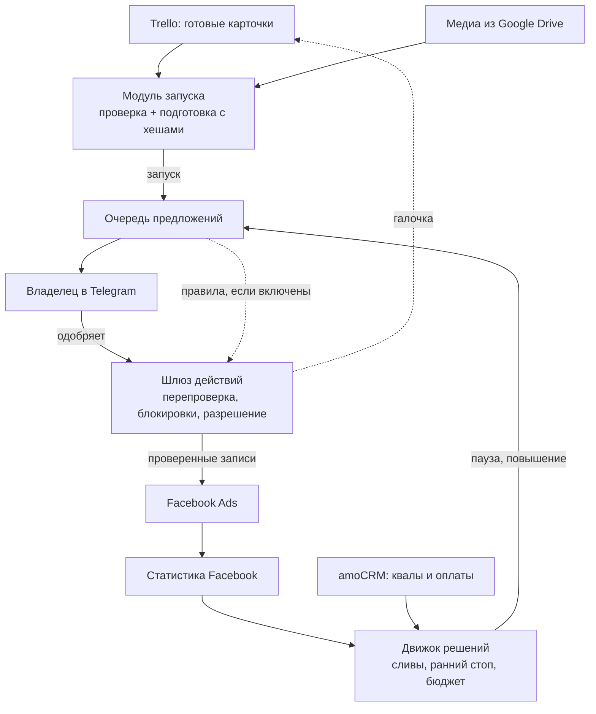

# Yuko

**Автономный медиабайер, который отключает рекламу по оплатам, а не по CPL.**

[](https://www.python.org/)
[](https://fastapi.tiangolo.com/)
[](LICENSE)
[](tests/)

**Русский** · [English version](README.md)

Yuko — автономный медиабайер для Facebook и Instagram. Он запускает креативы прямо с доски Trello, прослеживает каждое объявление до amoCRM, чтобы увидеть, какие лиды на самом деле квалифицировались и оплатили, и предлагает, что поставить на паузу, что масштабировать и что запускать дальше. Вы одобряете одним нажатием в Telegram или включаете правила, которые действуют сами.

- 🎯 **Судит рекламу по деньгам, а не по CPL.** Квалы, оплаты и ROMI по каждому объявлению прямо из CRM.
- 🚀 **Запускает из Trello.** Много городов и рекламных кабинетов, сбои не страшны: пропущенные города дозапускаются позже.
- 🛑 **Рано режет сливы.** Правила слива и раннего стопа с окнами созревания. Отсутствие данных никогда не приводит к паузе.
- 💸 **Масштабирует только то, что продаёт.** Бюджет поднимается только группам с оплатами, в рамках медиаплана и жёстких потолков.
- 🔒 **Безопасен по устройству.** Каждое изменение перепроверяется вживую, исполняется по одноразовому разрешению и сверяется после.
- 📲 **Владелец в контуре.** Подписанные кнопки в Telegram, ежедневная сводка и консоль команд.

Автоодобрение по умолчанию выключено. Все переключатели, которые меняют объявления, перечислены в разделе [Настройка](#настройка).

> **Эталонная реализация.** Yuko создавался для одного реального бизнеса и работал с его боевыми рекламными кабинетами; идентификаторы заменены. Прежде чем планировать развёртывание, прочитайте раздел [Статус и ограничения](#статус-и-ограничения).

---

## Зачем Yuko

Дешёвый лид — ещё не клиент. Лид-форма может приносить ровный поток лидов с низким CPL, которые так и не станут квалифицированными и ничего не оплатят. Если судить только по CPL, такое объявление выглядит победителем, хотя сжигает деньги. Обычно медиабайер узнаёт об этом, только когда проследит сделки в CRM до ID объявлений, а к тому времени бюджет уже потрачен.

Yuko замыкает цепочку между рекламной платформой и оплатами в CRM:

- Сопоставляет лиды amoCRM с объявлениями по точному `fb_ad_id`. Старые лиды, у которых его нет, сопоставляются запасным способом — по названию объявления. Затем считает квалифицированные лиды, оплаты, выручку и ROMI **по каждому объявлению**. По желанию учитывает и оплаты из вашей системы учёта оплат, так что продажа, которая попала туда, но не в CRM, тоже засчитывается. Это включается настройкой `payments_source`; по умолчанию такие оплаты только пишутся в лог.
- Даёт данным созреть, прежде чем выносить оценку. Правила, которым разрешено одобрять паузы самостоятельно, считают квалификацию только по зрелым лидам (по умолчанию — 72 ч). Для вердикта «нет оплат» объявлению должно быть не меньше 14 дней — это один цикл оплаты.
- Ставит на паузу, только когда выполнены явные пороги по доказательствам. Отсутствие данных из CRM никогда не приводит к паузе, а неизвестное число оплат никогда не принимается за ноль.

**Термины, которые встречаются ниже.** *MQL* — событие «квалифицированный лид». *Система учёта оплат* — место, где бизнес фиксирует фактические оплаты (бухгалтерская или биллинговая программа). *CityA…CityF*, *PRODA / PRODB* (Продукт A / B) и *L1 / L2* (два языка объявлений) — нейтральные метки: замените их своими городами, продуктами и языками.

## Что умеет

### Запуск креативов из Trello
- **Приём из очереди «Готово».** Берёт незапущенные карточки из колонки Trello «Готово» сверху вниз. Метки карточки задают тип кампании и целевые города. Если у карточки нет метки города, Yuko берёт город из конца её названия.
- **Медиа с Drive → формат объявления.** Скачивает файл или папку Google Drive из карточки и выбирает формат: одно объявление на каждое видео, объявления с одной картинкой, карусель (до 10 карточек) или пары под места размещения «лента + истории».
- **Подготовка с хешами.** Записывает на диск манифест, который фиксирует снимок карточки, SHA-256 всех байтов медиа, текст объявления, целевые группы объявлений и детерминированные названия объявлений. Запускается ровно то, что было одобрено.
- **Маршрутизация и поиск групп.** Сканирует рекламные кабинеты и находит самую новую действующую группу объявлений для каждой пары «город + тип группы» (язык объявлений, продукт, трафик на сайт). Карта в `settings.json` направляет каждую пару в свой рекламный кабинет. Пару без маршрута бот отклоняет; кабинета по умолчанию нет.
- **Предстартовая проверка.** Отказывается запускать в группу объявлений, которая не в статусе ACTIVE, уже содержит этот креатив или в которой не осталось места: у Facebook лимит 50 объявлений на группу, и ещё один слот держится в резерве.
- **Только объявления.** Запуск добавляет объявления в существующие группы и не трогает их бюджеты.
- **Попытки, которые переживают сбой.** Каждый запуск отслеживается по карточке и по городу. После сбоя итог восстанавливается по реальным данным Facebook, а пропущенные города позже дозапускаются без повторного запуска остальных.
- **Галочка — только когда объявления в эфире.** Страж запусков ставит галочку на карточке Trello, как только подтвердит, что объявления в статусе ACTIVE. Отдельная ежечасная сверка ставит галочки на карточки, объявления которых созданы в обход конвейера. Галочки она никогда не снимает.

### Оценка объявлений по результатам в CRM
- **Сопоставление с результатами в CRM.** Привязывает к каждому объявлению квалифицированные лиды, оплаты, выручку, ROMI и стоимость квалифицированного лида. Оплаты очищаются от дублей по контакту, а по оплатам из системы учёта берётся итоговое сальдо по каждой сделке. Когда этот источник включён, число оплат — большее из двух: по CRM или по системе учёта.
- **Правила слива.** *Подтверждённый слив* выполняет все условия ниже, и итогом становится предложение паузы владельцу:
  - потрачено больше $300 и получено не меньше 15 лидов;
  - квалификация ниже 25% или неизвестна;
  - ровно 0 оплат;
  - сверка с CRM завершена;
  - объявлению не меньше 14 дней.

  Два более узких правила смотрят только на зрелые данные, и только по ним действует узкий режим автоодобрения:
  - *зрелый ноль*: 15+ лидов старше 72 ч, ни один не квалифицирован, потрачено $150+, объявлению не меньше 5 дней;
  - *мёртвая тишина*: за последние 7 дней потрачено $50+ при нуле лидов, объявлению не меньше 10 дней.

  Оба правила проверены на исторических данных, прежде чем им разрешили действовать самостоятельно. Ещё два детектора ловят другие закономерности: **без выручки** (квалифицированные лиды есть, а продаж нет после $500+) и **семейство** (один креатив сливает деньги в нескольких городах). Календарное правило (0 лидов за всё время после 3 полных суток) тоже предлагает паузы, если не выставлено `thresholds.zero_leads_rule_enabled=false`.
- **Ранний стоп.** Четыре правила, у каждого свой режим `off / shadow / active` (по умолчанию `shadow`):
  - **A** (расход без лидов) и **B** (зрелые лиды, ни одного квалифицированного) работают ежечасно на объявлениях моложе 14 дней. Их пороги подстраиваются под собственный CPL кабинета.
  - **C** (квалификация слишком дорогая или ухудшилась) запускается раз в день по окну в 14 дней.
  - **S** ставит на паузу «голодающие» объявления (меньше $15 расхода за 14 дней, без лидов) в переполненных группах, чтобы освободить слоты. В коде указано, что такие объявления сливами не считаются.

  В режиме `active` правило само одобряет свои паузы. Правило A жертвует частью точности ради скорости, поэтому по умолчанию работает в `shadow`.
- **Ранжирование внутри портфеля.** Сравнивает каждое объявление с соседями по городу, типу группы и цели. Единственное объявление в своей группе сравнения никогда не отключается, лучшее — тоже.
- **Отсрочка вместо паузы.** Даёт объявлению с низким рейтингом, у которого есть потенциал по оплатам, несколько дней отсрочки, а если новых оплат так и нет — ставит его на паузу. По умолчанию выключено: `autopilot.hold_enabled`.
- **Недельный тренд по когортам.** Отслеживает долю квалифицированных лидов неделя к неделе с учётом измеренного уровня шума и интервалов Уилсона. Падающий тренд может наложить вето на повышение бюджета, добавить вес паузе или перевести слабое объявление (класса B) в паузу. Повышения он не запускает никогда. Поставляется в режиме `shadow`.
- **CRM → Meta.** Отправляет квалифицированные лиды из лид-форм обратно в Meta как события `MQL` через Conversions API, а также в GA4.

### Бюджет с тормозами
- **Только повышение и только для тех, кто продаёт.** Предлагает поднять бюджет группам объявлений в статусе ACTIVE, у объявлений которых есть подтверждённые оплаты. Бюджет никогда не снижает. Один значимый подтверждённый слив в группе блокирует повышения для всей группы.
- **Проверки по плану.** Перед повышением Yuko проверяет:
  - запас в недельном бюджете медиаплана;
  - ДРР (долю рекламных расходов в выручке) относительно целевой;
  - прогноз выручки из системы учёта оплат — ему доверяют, только если он прогрет, точен и свеж;
  - сезонную кривую темпа;
  - самопроверку прогноза.

  Если ни один источник плана прочитать не удалось, повышения блокируются.
- **Потолки.** Каждое повышение ограничено тремя способами: бюджетом на начало дня, потолком на группу объявлений и общим лимитом по кабинету. Ожидающие повышения резервируются на диске *до* вызова Facebook, поэтому сбой не может привести к двойному повышению.
- **Сторожа только на чтение.** Присылают оповещения о группах объявлений с нулевым расходом или перерасходом, аномальном дневном расходе, скачках CPL по городам, всплесках ошибок Facebook API, объявлениях в статусе DISAPPROVED, объявлениях с истёкшими акциями, которые всё ещё крутятся, лидах из Facebook, не дошедших до CRM, и замолчавших заданиях cron.

### Аналитика креативов
- **Внимание и результат.** Отслеживает hook rate, hold rate, матрицу креативов 2×2 (Победитель / Кликбейт / Скрытая жемчужина / Мёртвый) и признаки выгорания. Всё это хранится вместе с результатами из CRM в базе знаний о креативах на SQLite.
- **Оценка и диагностика.** Оценка по шкале 0–100: Gemini разбирает изображение и текст. Пошаговая диагностика (зацепка → удержание → CTR → конверсия → выгорание) выдаёт одно конкретное исправление и самых похожих победителей.
- **Закономерности.** Поиск закономерностей показывает, какие срезы работают лучше базового уровня. Движок ранних сигналов учится определять, какие метрики за 1–7-й день предсказывают итоговый успех в CRM за всё время объявления, причём данные о результатах никогда не попадают в его признаки.
- **Брифы с проверкой фактов.** По умолчанию выключено. Темы сначала закрывают пробелы в охвате, затем дают вариации креативов, которые реально продавали. Сценарий пишет Claude. Детерминированная проверка отсекает выдуманную статистику, фальшивые сроки и неверный формат, после чего запускается вторая проверка через LLM. Одобрение владельца должно превращать бриф в карточку Trello, но эта кнопка пока не подключена (см. [Известные пробелы](#статус-и-ограничения)).
- **Копирайтер.** Выдаёт структурированные варианты объявлений через принудительный вызов инструмента и проверяет их по схеме Pydantic. Примеры для модели (few-shot) берутся из победителей и проигравших в базе знаний.
- **Журнал гипотез.** Записывает измеримое ожидание к запуску и через 7–14 дней сверяет его с реальными продажами. Вердикт влияет на выбор будущих тем. Запуски, которые идут через шлюз одобрения, пока не записывают гипотезу (см. «Известные пробелы»).

### Дашборд и контроль владельца
- **Дашборд.** Одностраничный интерфейс из 12 вкладок, который отдаёт FastAPI: Обзор, Запуск, Аналитика, Воронка, Источники, Сравнение, Обучение, Решения, История, Генератор, Настройки, Уведомления. Сам интерфейс на русском; названия вкладок здесь даны в переводе. Любой путь API требует `X-API-Key`, кроме вебхука amoCRM, который проверяет собственный общий секрет. Каркас дашборда, `/health` и статические файлы открыты публично. Методы API, которые обращаются к внешним сервисам, ограничены по частоте запросов.
- **Telegram.** В карточках одобрения — подписанные кнопки «Одобрить / Отклонить / Отложить». Кроме того, предложения собираются в ежедневную сводку с кнопками «одобрить всё» / «отклонить всё». Среди команд консоли — `/status`, `/queue`, `/pause`, `/unpause`, `/scale`, `/launch` и `/digest`. Команды, которые должны что-то изменить, лишь создают предложения.

## Как это работает



1. **Предложить.** Модуль запуска, автопилоты, ранний стоп, масштабирование бюджета и консоль Telegram никогда не пишут в Facebook. Каждый из них оформляет неизменяемое предложение: намеченное изменение (payload), его SHA-256 и подтверждающие доказательства. Предложение живёт 48 ч или 4 ч, если оно пришло из команды консоли Telegram.
2. **Решить.** Владелец нажимает подписанную кнопку в Telegram. Там, где владелец это включил, вместо него одобряет именованное правило. Одобрения правилами записываются как решения `SYSTEM`, поэтому в журнале аудита они всегда отличаются от нажатий человека.
3. **Перепроверить.** Каждые 30 минут очередь исполнения забирает одобренные задания. Для каждого она пересобирает манифест по актуальному состоянию и заново читает Facebook, Trello, байты медиа, amoCRM и систему учёта оплат. Если с момента одобрения что-то изменилось, задание останавливается.
4. **Записать.** Одноразовое разрешение выдаётся после перепроверки вживую. Оно гасится в той же транзакции, которая начинает попытку, ещё до любого сетевого вызова.
   - Пауза, снятие с паузы и изменение бюджета делают ровно один изменяющий вызов. Повторно он отправляется, только если Facebook ответил ошибкой превышения лимита запросов.
   - Попытка запуска загружает медиа, затем создаёт объявления. Перед каждым вызовом создания объявления она сохраняет долговечную запись о намерении (claim).
   - Явный отказ записывается как отказ. Неоднозначный исход записывается как `UNKNOWN` и разрешается чтением, а не слепым повтором.
5. **Проверить.** Чтение вживую после записи подтверждает изменение. Отдельный проверяющий модуль, работающий только на чтение, перепроверяет всё за последние 24 ч и разрешает неясные исходы по фактическим данным сервисов.

## День с Yuko

APScheduler выполняет около 50 заданий внутри приложения FastAPI по фиксированному локальному часовому поясу (по умолчанию `Etc/GMT-5`, то есть UTC+5). Большинство заданий срабатывает каждые 10–30 минут и само проверяет час. Каждое хранит состояние по временным слотам, так что повторное срабатывание не может выполнить одно и то же задание дважды. В таблице ниже — выборка.

| Время | Что запускается |
| --- | --- |
| 00 · 06 · 12 · 18 | Сопоставление результатов из amoCRM с каждым объявлением |
| 01:xx–05:xx | Синхронизация недавних объявлений (01), дозаполнение базы знаний о креативах (02–05), дозаполнение дневных метрик (03–05) |
| 03:xx | Страж истёкших акций: оповещает об объявлениях, которые продолжают тратить после даты окончания акции |
| 04:xx | Резервная копия `decisions.db` (хранится 7 копий) |
| 05:xx | Проверка заполненности групп объявлений (только чтение) |
| 06:xx | Снимок дневных метрик · вердикты по гипотезам · чистильщик слотов раз в 3 дня (по умолчанию вхолостую) |
| 07:xx | Синхронизация оплат из системы учёта |
| 08:xx | Сбор расходов Google Ads · утренняя сводка · первый прогон живого автопилота и защитника (далее каждые 2 ч до 22:00) |
| 09:xx | Сводка предложений для владельца · итог автономных пауз (только если паузы были) · страж расходов групп объявлений · сводка покрытия |
| 10:xx | Ежедневный прогон автозапуска · классический автопилот · правила раннего стопа C и S · отчёт по онлайн-продажам |
| 11:xx | Недельные когорты (исходные данные для тренда) |
| 12:xx | Полное обновление расходов и статусов |
| 13:xx | Масштабирование бюджета |
| 14:xx | Проверка сегодняшних запусков: отклонённые объявления, зависшие на модерации и с 0 показов |
| 15:xx · 20:xx | Классический автопилот; после 20:00 — ежедневная сводка по воронке запусков |
| 21:xx | Вечерний отчёт |

**Весь день:**
- Каждую минуту: нажатия кнопок владельцем.
- Ежечасно: правила раннего стопа A и B, сверка галочек Trello.
- Каждые 30 мин: исполнение одобренных заданий, события CAPI `MQL`, страж запусков, страж покрытия.
- Каждые 15 мин: доставка сообщений владельцу, проверка после исполнения, страж лидов из Facebook, проверка инвариантов автономности.

**Раз в неделю:** воскресенье — поиск закономерностей и движок ранних сигналов (рано утром), итоговая таблица показателей (19:xx), отчёт об обучении (20:xx). Понедельник и четверг, 08:xx — генератор брифов (по умолчанию выключен).

## Безопасность прежде всего

Yuko рассчитан на работу с боевым рекламным кабинетом, по которому идут реальные деньги, поэтому каждый путь записи устроен так, чтобы при сбое отказывать безопасно.

- **Предложения, а не изменения.** Код, который принимает решения, оформляет предложения, а не меняет объявления. Единственное исключение — шаг архивации у чистильщика слотов, по умолчанию выключенный. Публичные точки входа `execute_action` всегда выбрасывают `OwnerConsentRequired`.
- **Один заверенный транспорт.** Только `integrations/facebook_ads_mutation_transport.py` пишет в Marketing API по одобренным предложениям. Он умеет:
  - менять статус объявления;
  - задавать бюджет группы объявлений;
  - создавать объявление и загружать медиа, без которых его не создать.

  Путь одобрения не может ничего удалить, заархивировать или переименовать: такие вызовы интеграции выбрасывают `ForbiddenMutation`. Перед каждым HTTP-вызовом транспорт заново читает сохранённую запись одобренной попытки и проверяет, что кабинет, ресурс и хеш изменения совпадают. AST-тесты не дают модулям, принимающим решения, его импортировать. Два пути обходят этот транспорт; они перечислены в разделе «Статус и ограничения».
- **Одобрение привязано к владельцу.** Кнопки одобрения («Одобрить / Отклонить / Отложить» и пакетные кнопки сводки) несут только nonce и укороченный HMAC, без бизнес-идентификаторов. Каждая кнопка привязана к одному сообщению, одному владельцу и одному чату, срабатывает один раз и со временем истекает. Старые информационные кнопки всё ещё несут сырые ID (см. «Известные пробелы»).
- **Перепроверка перед каждой записью.** Пять источников перечитываются вживую. Facebook читается и до, и после остальных, так что любое расхождение в этом промежутке прерывает проверку. Поставить на паузу последнее объявление в статусе ACTIVE в группе бот отказывается.
- **При сомнении — без повторного изменения.** База данных отказывает во втором разрешении для записи о намерении, по которой уже есть попытка. Сверка только читает.
- **Ключи идемпотентности.** Ключи — канонические UUID4, надёжно привязанные к хешу изменения. Перед каждым вызовом создания объявления сохраняется долговечная запись о намерении, поэтому «нет записей» доказывает «нет объявлений».
- **Упорядоченные блокировки.** Файловые блокировки всегда берутся в одном и том же порядке (операция → запуск → группы объявлений по возрастанию номера), что исключает взаимные блокировки между рабочими процессами.
- **Правила обеспечивает база данных.** Триггеры SQLite отклоняют недопустимые решения, разрешения, попытки и скачки состояний. Таблицы истории — только на добавление. У миграций 019–028 проверяются контрольные суммы, а при запуске схема сверяется с манифестом в коде.
- **По умолчанию — отказ.** Город без маршрута, неполная постраничная выдача Facebook, неизвестный статус объявления, повреждённое состояние потолков или нечитаемый план ведут к отказу, а не к догадке.
- **Автономность — только по явному включению.** У автоодобрения три независимых переключателя, все по умолчанию выключены:
  - **Паузы автопилота.** `autopilot.autonomous.pause_confirmed_wasters` покрывает паузы по правилам «зрелый ноль» и «мёртвая тишина». `pause_all_candidates` покрывает все паузы, которые предлагает автопилот. Оба требуют буквального JSON-значения `true`. Предохранитель от аномалий отменяет эти автоодобрения, когда кандидатов 10 или больше и их число более чем в 3 раза превышает медиану последних прогонов. Страж присылает оповещение, если при включённой полной автономности карточка паузы всё же доходит до владельца.
  - **Ранний стоп.** Правила в режиме `active` сами одобряют свои паузы, не больше 10 в день для A+B+C и 30 в день для S. Предохранитель от аномалий на них не распространяется.
  - **Запуски.** `launch.auto_approve=true` включает автоодобрение предложений запуска.
- **Изолированные тесты.** Набор тестов работает на временной базе, с заблокированными реальными сокетами (`pytest-socket`) и фиктивным токеном, поэтому тест не может достучаться до Facebook.

## Структура проекта

```text
agent/          Модуль запуска, анализатор, модуль обучения, поиск групп объявлений, копирайтеры, инициализация БД, чтение и запись настроек
integrations/   Facebook (чтение + заверенный транспорт изменений), CAPI, Ad Library, amoCRM,
                Trello, Google Drive / Sheets / Ads, GA4, Gemini vision
services/       Основная логика: конвейер запуска, политика решений, правила слива, ранний стоп,
                масштабирование бюджета, шлюз одобрения, исполнитель, проверка, аналитика креативов, брифы
web/            Приложение FastAPI, задания APScheduler, роутеры API, ограничение частоты запросов, дашборд (static/index.html)
migrations/     SQL-миграции: 004–032 для SQLite (у 019–028 проверяются контрольные суммы); 001–003 — старые для Postgres, не применяются
scripts/        Консольные утилиты оператора: аварийный запуск, восстановление запусков, сверка галочек Trello, дозаполнения, выгрузки
tests/          307 файлов тестов; без сети, на временной базе
docs/product/   Справка о продуктах: единственные факты, которые разрешено использовать генератору брифов
config.py       Настройки из переменных окружения, шаблоны текстов объявлений, статические запасные карты
main.py         Точка входа (uvicorn web.app:app)
data/           Рабочее состояние, исключено из git: decisions.db, settings.json, JSON-файлы состояния, блокировки
```

## Быстрый старт

```bash
git clone https://github.com/kuro97/yuko-ads.git
cd yuko-ads
python3.13 -m venv venv && source venv/bin/activate
pip install -r requirements.lock
cp .env.example .env        # впишите свои токены и ID, задайте API_KEY
python main.py              # затем откройте http://localhost:8000
```

- Дашборд запрашивает ваш `API_KEY` и передаёт его в заголовке. Если `API_KEY` не задан, API отвечает `503`.
- **Доступ из сети.** По умолчанию `main.py` слушает `0.0.0.0` (`WEB_HOST`) и запускает uvicorn с автоперезагрузкой. Для любого использования за пределами локальной разработки задайте `WEB_HOST=127.0.0.1`, выключите перезагрузку и поставьте приложение за обратный прокси с TLS.
- В `requirements.lock` нет двух пакетов, которые перечислены в `requirements.txt`. Если они нужны, установите их отдельно:
  - `sentence-transformers` — оценка похожести карточек. Без него оценка молча работает хуже.
  - `google-ads` — нужен только клиенту Google Ads API.
- Для миниатюр видео и анализа кадров нужен `ffmpeg` в `PATH`.
- Планировщик стартует вместе с веб-приложением. Что работает по умолчанию — см. [Включение изменений](#настройка).

Чтобы прогнать тесты (сеть и настоящие токены не нужны):

```bash
pip install -r requirements-dev.txt
pytest -q
```

## Настройка

| Где | Что |
| --- | --- |
| `.env` (из `.env.example`) | Учётные данные Facebook, amoCRM, Trello, Telegram, LLM и Google; ID рекламных кабинетов; `API_KEY`; `WEB_HOST` / `WEB_PORT`. Настройки одобрения в Telegram загружаются, только если ID владельца и чата — целые числа, а секреты callback и вебхука не короче 32 байт, не заглушки и отличаются друг от друга и от токена бота. |
| `config.py` | Всё, что читается из окружения, плюс фиксированные шаблоны текстов объявлений (`AD_BODY`, `AD_TITLE` и варианты под продукты) и статические карты групп объявлений. |
| `data/settings.json` (через дашборд) | Переключатели, которые действуют во время работы и накладываются поверх значений по умолчанию из кода. Меняются во вкладке «Настройки» и проверяются в `web/settings_validation.py`: блок `autopilot`, `approval.digest_hour`, `brief_generator.enabled`. |
| `data/settings.json` (вручную) | `launch_routing` (город × тип группы → рекламный кабинет) и `launch.auto_approve`. API настроек эти ключи не принимает. |
| `agent/adset_discovery.py` | Поиск действующих групп объявлений по правилам именования: метки языка объявлений, продукта и трафика на сайт/MQL в названии группы. Статические карты в `config.py` — только запасной вариант. |
| `docs/product/fact-sheet-acme.md` | Продукты, акции, сроки и допустимые числа для генератора брифов. Часть парсера жёстко прописана в `services/fact_sheet.py`. |

**Изменения объявлений включаются только явно.** Из коробки выключены все переключатели, которые меняют объявления:
- `autopilot.enabled=false`, `mode=dry_run`, `launch_enabled=false`, `scale_enabled=false`;
- `launch_checker.mode=observe`;
- правила раннего стопа и тренд — в `shadow`;
- `hold_enabled=false`, `slot_cleaner.enabled=false`, `payments_source=shadow`;
- флаги автоодобрения `autonomous.pause_confirmed_wasters`, `autonomous.pause_all_candidates` и `launch.auto_approve` выключены.

Чтобы включить:
- **Ежедневным предложениям автозапуска** нужны `enabled`, `launch_enabled`, `launch_checker.mode=enforce` и `kill_switch=false`. Ручным запускам из дашборда или через `/launch` нужен только `launch_checker.mode=enforce`.
- **Повышениям бюджета** дополнительно нужен `scale_enabled`.
- **`kill_switch`** останавливает новые предложения от автопилотов, автозапуска, масштабирования бюджета, раннего стопа, защитника и восстановления запусков. Он не останавливает:
  - уже одобренные задания;
  - чистильщик слотов;
  - сверку галочек Trello;
  - синхронизацию CAPI;
  - команды консоли Telegram;
  - запуски из дашборда.

**Работает, как только заданы учётные данные.** Планировщик нельзя выключить отдельно от веб-приложения. Даже если все переключатели выше выключены, он:
- каждые 30 мин отправляет события `MQL` в CAPI и GA4;
- ставит галочки на карточки Trello для уже работающих объявлений (ежечасно);
- присылает в Telegram отчёты, оповещения и планы холостых прогонов.

Чтобы события не отправлялись, оставьте пустыми `FB_DATASET_ID`, `GA_MEASUREMENT_ID` и `GA_API_SECRET`.

## Статус и ограничения

- **Сделан для одного бизнеса.** Yuko — эталонная реализация под один стек: Facebook Ads + amoCRM (Kommo) + Trello + Telegram, плюс Google Drive / Sheets и система учёта оплат компании. Это приложение для одной компании (single-tenant) — с одним владельцем в Telegram и одним чатом на установку, а не SaaS-продукт.
- **Обезличенные идентификаторы.** Компания называется ACME, рекламные кабинеты — `cabinet_a` / `cabinet_b`, все ID ненастоящие. Города, продуктовые линейки и языки объявлений — нейтральные метки.
- **Жёстко прописанная специфика.** Перенос на другой бизнес — это правка кода, а не только настроек. Всё перечисленное задано в коде:
  - список городов, продуктовых линеек и языков объявлений (в виде меток);
  - часовой пояс по умолчанию и пример сезонной кривой темпа;
  - названия списков Trello и слова в метках, которые задают тип кампании;
  - правила именования групп объявлений;
  - ID полей и статусов amoCRM.
- **Теневой режим, холостой прогон и выключено.** Многие функции поставляются в теневом режиме, в режиме холостого прогона или выключенными: ранний стоп, тренд, учёт оплат из системы учёта, отсрочка, правила защитника, чистильщик слотов и восстановление запусков.
- **Запись в обход заверенного транспорта.** Два пути пишут в Facebook, минуя его:
  - чистильщик слотов архивирует объявления, которые стоят на паузе 14+ дней, чтобы освободить слоты. Он работает вхолостую, пока не включён `slot_cleaner.enabled`.
  - аварийный `scripts/manual_launch.py` работает вхолостую, если не передать `--apply --confirm-production LAUNCH-NOW`.
- **Известные пробелы:**
  - Старые кнопки Telegram с сырыми ID текущий цикл опроса не обрабатывает: «Одобрить / Отклонить» у брифов, «Вернуть» после паузы, «Остановить запуск» и «Поставить на паузу» у истёкших акций. Поэтому одобренные брифы так и не попадают в Trello. Чтобы отменить паузу, используйте `/unpause <ad_id>`.
  - Запуски, исполненные через шлюз одобрения, не создают запись в журнале гипотез.
  - Галочка в Trello может появиться раньше, чем заработают все города; это компенсирует путь дозапуска.
  - Адаптер исполнения ограничивает рост бюджета 15% в день, хотя настройки принимают и большие значения.
  - При включённой самопроверке прогноза повышения остаются заблокированными, пока не накопится примерно неделя истории за тот же месяц.
  - Мониторинг конкурентов и обработчик вебхука Telegram существуют, но не подключены.
- **Устаревший код.** Остатки прежней версии для многих компаний (multi-tenant) не участвуют в работе текущей версии для одной компании: клиент Supabase, модуль биллинга Stripe и миграции Postgres 001–003.
- **Язык.** Дашборд, сообщения в Telegram, промпты для LLM, шаблоны текстов объявлений и большинство комментариев в коде — на русском; второй язык объявлений (L2) — метка-заглушка. Часть строк документации (docstring) разошлась с кодом. Внутренние проектные спецификации, на которые ссылаются комментарии (`docs/specs/...`), не опубликованы.

## Контакты

Вопросы и предложения — пишите в Telegram: [@bai_alisher](https://t.me/bai_alisher)

## Лицензия

MIT. См. [LICENSE](LICENSE).
